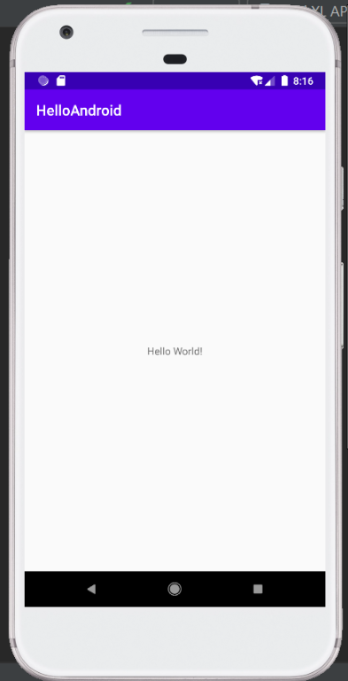
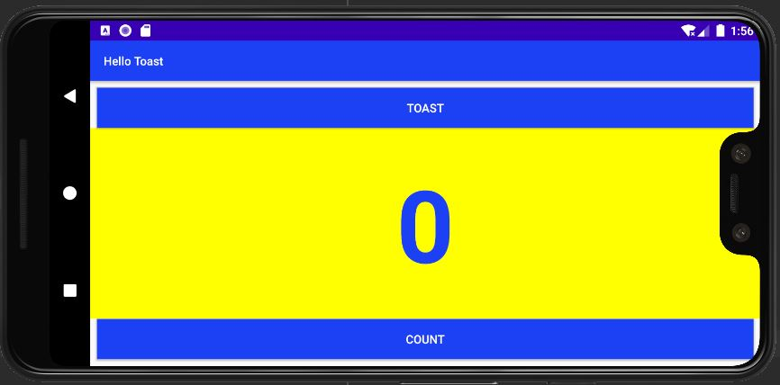
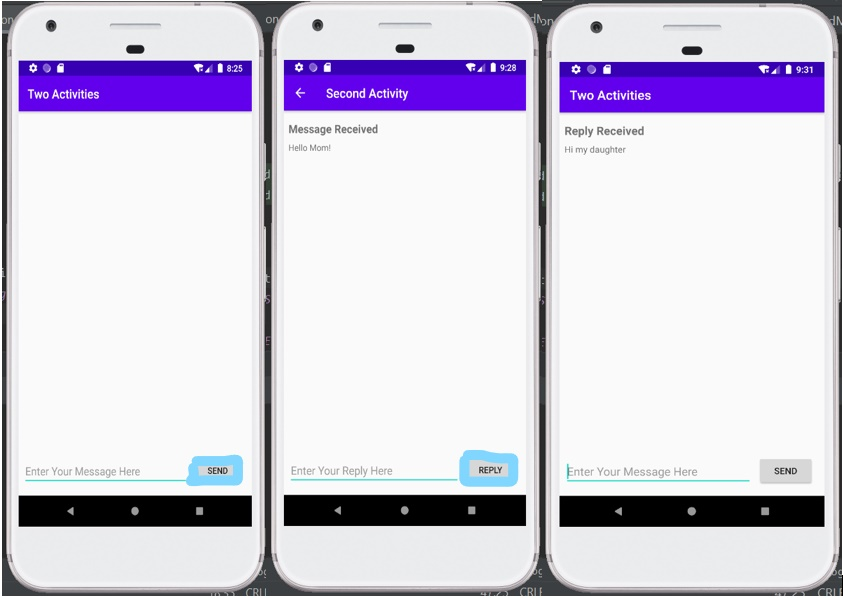
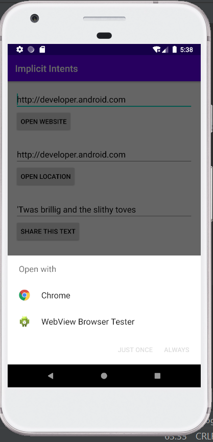
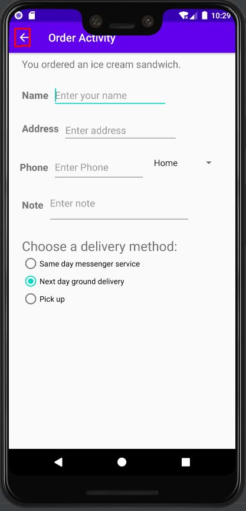
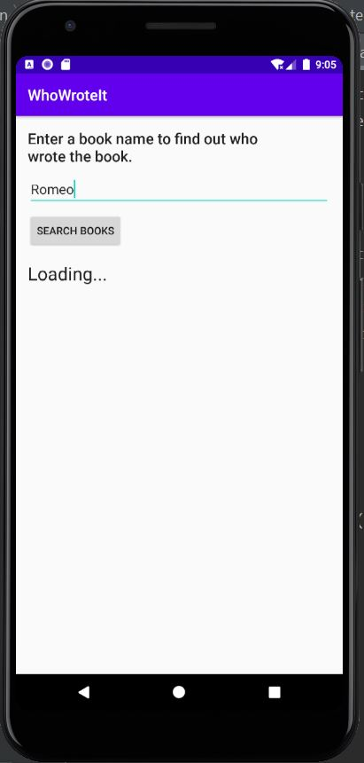

## Intelligent Mobile Development course
### Week 2. Getting Started
. Codelab 1: Android and Hello World  

### Week 3. Layouts and Resources for UI
. Codelab 1.2.PartA: My first interactive UI  

.Codelab 1.2.PartB: The layout Editor  

### Week 4. Activity and Intents
. Codelab 2.1: Activity and Intents  

### Week 5. Implicit Intents
. Codelab 2.3: Implicit Intents  

### Week 6. User Interaction
. Codelab 4.1: Clickable images  

. Codelab 4.2: Input Controls  

### Week 7. User Interaction
. Codelab 4.4: User Navigation  

. Codelab 4.5: RecyclerView  

### Week 8. Metrial Design
. Codelab 5.2: Cards and Colors  

### Week 9. Background Tasks
. Codelab 7.2: AsyncTask and AsyncTaskLoader  

### Week 10. Notifications
. Codelab 8.1: Notifications  

### Week 11. Shared Preferences
. Codelab 9.1: Shared Preferences  

